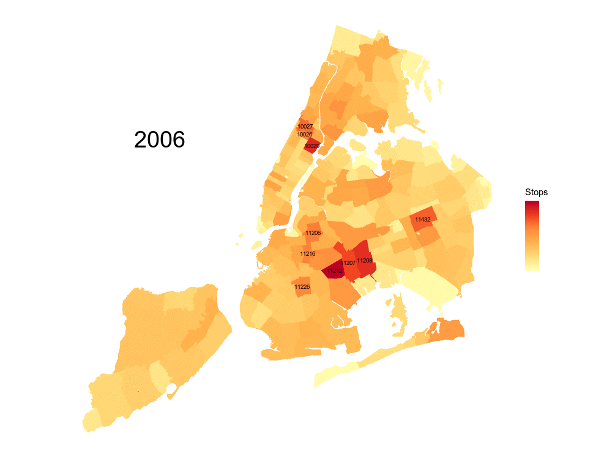
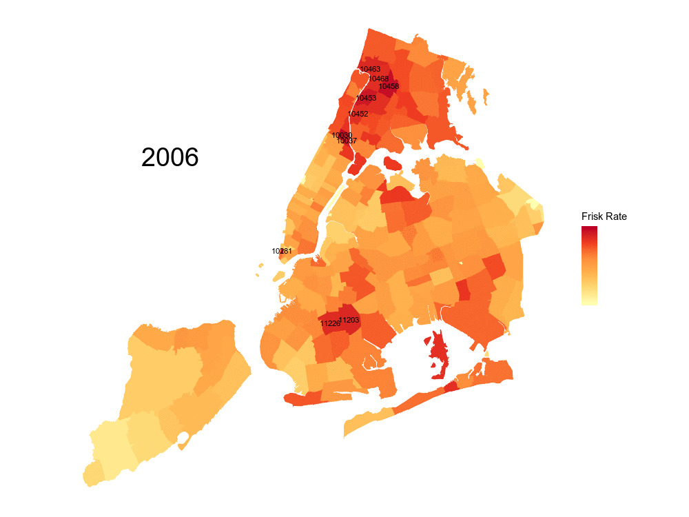
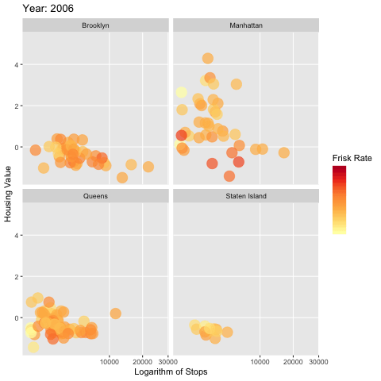

Spatial Statistics Final Project
================
Brusco, Bianca; Wang, Hongting; Yang, Lingfeng
10/26/2018

Introduction
------------

Stop and Frisk in New York City was a program of the NYPD (New York Police Department) to control crime, which involved stopping, questioning and in some cases searching citizens on the streets. The program was highly controversial, due to the high discretionary power given to the police in choosing who to stop and where. The data on the number and type of stops, which is now publicly available, have been used to understand whether the stops had an effect in reducing crimes, whether they were racially charged, or a number of other questions on the program.

In this project, we are interested in learning more about how, during these years, wealth of a specific neighbourhood related to the number of stops performed by the police, and whether the first is a good predictor of the second. We chose housing value as a proxy for neighborhodd wealth in this case. We are curious in this question because it gives a starting point for investigation on whether the police discriminated neighborhoods in terms of their wealth. While true that poorer neighborhoods have a higher crime rate, it is also true that commuting is common in NYC, and hence a great number of people that spend their day in different areas from where they live. Our hypothesis, therefore, is that, if there is no discrimination in terms of neighborhood wealth, the housing value at a specific zipcode will only be weakly correlated with the number of stops performed there. The opposite will occur if poorer neighborhoods were targeted more heavily than needed, although the relationship would be then further examined to establish causality.

In the project, we start by exploring the data available to us, to identify patterns. We then attempt at fitting a model that takes with variables of interest, taking in consideration the spatial component of the problem at hand.

1. Importing and Cleaning data
==============================

In this project we used two sources of data. The first one is the data from NYC Open Data of Stops and Frisks throughout the years of 2006 and 2013. For the purpose of our project we aggregated this data at the zip-code and yearly level. The second source of data is the housing value index made available by the company Zillow at <https://www.zillow.com/research/data/>. We downloaded Zillow Housing Value Index Data at the grain of zip-code and month, for the years of interest.

A. Importing data
-----------------

### (i). Housing value panel data

``` r
# Housing value
hvraw <- read.csv("data/Trimmed_home_value.csv", header = T)
```

### (ii). NYC Stop & Frisk data

``` r
# Stop & Frisk
load("data/sqf.RData")
```

B. Cleaning data
----------------

### (i) Housing Value

We first trim the ZHVI dataset to only contain the years we are interest in (2016 until 2013), as well as only our city of interest, New York City.

``` r
# select relevant date range for housing value, filter out other cities
hv <- hvraw %>% filter(City == "New York") %>% dplyr::select(RegionName, CountyName, 
    X2005.12:X2014.01) %>% arrange(RegionName)
```

### (ii) Stop & Frisk

We then move to cleaning the data's spatial attributes. We note that in the Stop&Frisk dataset there are some latitudes and longitudes that appear to be a mistake, as they show outside the boundaries of the city. To delete these observations, we look at the geographical boundaries of NYC, and then removed all the observations that laid outside of it. Source of geographic boundaries of NYC: <https://www.mapdevelopers.com/geocode_bounding_box.php>

North Latitude: 40.917577 South Latitude: 40.477399 East Longitude: -73.700272 West Longitude: -74.259090

``` r
# filter out NAs for lon and lat, 1303 NAs and 47 '1900-12-31' for date,
# then select columns of interest, sorted in chronological order
sf <- stops %>% filter(lat > 40.2 & !is.na(lat) & lat < 41) %>% filter(date >= 
    "2006-01-01" & date <= "2013-12-31") %>% dplyr::select(year, date, time, 
    precinct, suspected.crime, frisked, suspect.race, found.weapon, lat, lon) %>% 
    arrange(date, time) %>% mutate(month = substr(date, 6, 7))
```

#### shapefiles for zip code bounds and NYC

In order to merge the two data files, we used the Zip Code shapefile, avilable of NYC Open Data (<https://data.cityofnewyork.us/Business/Zip-Code-Boundaries/i8iw-xf4u>). The shapefile allowed us to identify within which Zip code a stop happened.

    ## OGR data source with driver: ESRI Shapefile 
    ## Source: "/Users/George/Desktop/A3SR/APSTA-GE-2015/Final_Project/Final/Stop_and_Frisk_Project/data/zip_code/ZIP_CODE_040114.shp", layer: "ZIP_CODE_040114"
    ## with 263 features
    ## It has 12 fields

    ## OGR data source with driver: ESRI Shapefile 
    ## Source: "/Users/George/Desktop/A3SR/APSTA-GE-2015/Final_Project/Final/Stop_and_Frisk_Project/data/Borough_Boundaries/geo_export_5e515234-1937-40b5-b942-1ef10ea3ea45.shp", layer: "geo_export_5e515234-1937-40b5-b942-1ef10ea3ea45"
    ## with 5 features
    ## It has 4 fields

#### Add zip code field to Stop & Frisk based on coordinates

We check over which zip-code polygon each of the stops is. We then examine which stops have a missing values with the below plot:

``` r
coord1 <- cbind(sf$lon, sf$lat)
points <- SpatialPoints(coord1, CRS("+proj=longlat +ellps=WGS84 +no_defs"))
reversezip <- over(points, zipbd)
# over function checks which spatial polygon a list of points fall into

plot(zipbd, border = "black", lwd = 0.2)
points(sf$lon[which(is.na(reversezip$ZIPCODE))], sf$lat[which(is.na(reversezip$ZIPCODE))], 
    pch = ".", cex = 2.5, col = "red", main = "Missing 'matches'")
```

 It appears that all the missing values lie right on the boundaries of two different zipcodes, which is why the overlaying function does not work appropriately. To fix this, we will find 8 surrounding points (all of whom of equal distance to the original point), from north going clockwise. We will then get the zipcode for all those 8 points and exclude NAs before taking a majority vote. Finally, we use the majority vote result to impute the NAs.

#### Imputing boundary points

``` r
# The distance from the original point is about 370 ft.
zipcorrect <- function(lon, lat, shp) {
    revzip <- rep(NA, length(lon))
    for (i in 1:length(lon)) {
        # starting from north, rotating clockwise for the 8 sample points
        samp.lon <- c(lon[i], lon[i] + 0.001, lon[i] + 0.0014, lon[i] + 0.001, 
            lon[i], lon[i] - 0.001, lon[i] - 0.0014, lon[i] - 0.001)
        samp.lat <- c(lat[i] + 0.0014, lat[i] + 0.001, lat[i], lat[i] - 0.001, 
            lat[i] - 0.0014, lat[i] - 0.001, lat[i], lat[i] + 0.001)
        
        samp.coord <- cbind(samp.lon, samp.lat)
        
        samp.points <- SpatialPoints(samp.coord, CRS("+proj=longlat +ellps=WGS84 +no_defs"))
        
        samp.zip <- as.character(over(samp.points, shp)$ZIPCODE)
        shortzip <- samp.zip[which(!is.na(samp.zip))]
        
        revzip[i] <- shortzip[which.max(tabulate(match(shortzip, unique(shortzip))))]
    }
    return(revzip)
}
```

#### Join the boundary points to Zipcodes

``` r
zipmiss <- sf[which(is.na(reversezip$ZIPCODE)), c(10, 9)]
imputedzip <- zipcorrect(zipmiss$lon, zipmiss$lat, zipbd)

# Append zipcode and zipcode related fields to Stop & Frisk
sf$zip <- as.character(reversezip$ZIPCODE)
sf$zip[which(is.na(sf$zip))] <- imputedzip
```

C. group stop & frisk data based zipcode
----------------------------------------

We now add attributes from the ZIPCODE data table, such as population and area.

``` r
jointable <- zipbd@data %>% dplyr::select(zip = ZIPCODE, po_name = PO_NAME, 
    pop = POPULATION, area = AREA, county = COUNTY) %>% arrange(zip, desc(area))
```

Within the jointable, there is one duplicate record of zipcode 10047. There are other regions with multiple polygons associated with one zip code (10004 for instance). For these cases, we aggregate the land area and take any one of the population entry. It is cleaned in the following chunk.

``` r
jtclean <- jointable[!duplicated(jointable), ]
jtclean <- jtclean %>% group_by(zip) %>% summarize(po_name = first(po_name), 
    pop = first(pop), area = sum(area), county = first(county)) %>% as.data.frame()

jtclean$zip <- as.character(jtclean$zip)
jtclean$county <- as.character(jtclean$county)

jtclean$county[which(jtclean$county == "New York")] <- "Manhattan"
jtclean$county[which(jtclean$county == "Richmond")] <- "Staten Island"
jtclean$county[which(jtclean$county == "Kings")] <- "Brooklyn"
colnames(jtclean)[5] <- "borough"
```

### Merging tables

``` r
## merge the stop and frisk file with the clean join table, as well as the
## zip file
sf_large <- left_join(sf, jtclean)
```

    ## Joining, by = "zip"

``` r
zip_large <- right_join(sf, jtclean)
```

    ## Joining, by = "zip"

### Group data on zipcode

``` r
sf_rate <- sf_large %>% group_by(zip, year, month) %>% summarise(frisked = sum(frisked), 
    stops = n(), po_name = first(po_name), pop = first(pop), area = first(area), 
    borough = first(borough)) %>% as.data.frame()
```

### inspect difference between zipbd, housing value, and stop and frisk

To understand why there is more zipcodes in the shape file than in the Stop and Frisk files, we analyze the zipcodes dataset:

``` r
kable(head(zipbd@data[, 1:10], 3))
```

|     | ZIPCODE | BLDGZIP | PO\_NAME |  POPULATION|      AREA| STATE | COUNTY | ST\_FIPS | CTY\_FIPS | URL                    |
|-----|:--------|:--------|:---------|-----------:|---------:|:------|:-------|:---------|:----------|:-----------------------|
| 0   | 11436   | 0       | Jamaica  |       18681|  22699295| NY    | Queens | 36       | 081       | <http://www.usps.com/> |
| 1   | 11213   | 0       | Brooklyn |       62426|  29631004| NY    | Kings  | 36       | 047       | <http://www.usps.com/> |
| 2   | 11212   | 0       | Brooklyn |       83866|  41972104| NY    | Kings  | 36       | 047       | <http://www.usps.com/> |

We note that there is a column called BLGZIP, which is a binary variable that indicates whether a particular zipcode is specific to a certain building. For exmample, the World Trade Center has its own Zip Code, as well as other important buildings in the city. Since these zipcodes are private or enclosed spaces, there are no stops within them. We remove any zipcodes for which BLDGZIP = TRUE.

``` r
nbzipbd <- subset(zipbd, BLDGZIP == 0)
# now stop and frisk matches the shapefile zips.
```

After subsetting this way, there are the same number of zipcodes (193) in the shape file as there are in the Stop and Frisk file.

We now want to joing the ZHVI (Zillow Housing Value Index) data with the Stop and Frisk file. To do so, we need to put the ZHVI data in a long format. For each zip, month, year, we want to have a specific ZHVI so we can join with the rates table.

``` r
hvlong = melt(hv, id.vars = c("RegionName", "CountyName"), value.name = "zhvi")
hvlong = hvlong[, -2]  #don't need county name, drop it
# cleaning because the data variable is in weird format (i.e. X2005
hvlong = hvlong %>% mutate(variable = gsub("X", "", variable)) %>% mutate(variable = gsub("\\.", 
    "-", variable)) %>% arrange(RegionName)
hvlong = hvlong %>% mutate(variable = as.Date(paste0(variable, "-01"))) %>% 
    mutate(year = lubridate::year(variable), month = lubridate::month(variable)) %>% 
    rename(zip = RegionName)

hvlong = hvlong[, c(1, 4, 5, 3)]  #reorder 
hvlong$zip = as.character(hvlong$zip)
sf_rate$year = as.double(sf_rate$year)  #change variable type for join to work
sf_rate$month = as.double(sf_rate$month)

sfhv = left_join(sf_rate, hvlong, by = c("zip", "year", "month"))
head(sfhv, 3)
```

    ##     zip year month frisked stops      po_name pop     area   borough zhvi
    ## 1 00083 2006     1      15    77 Central Park  25 38300990 Manhattan   NA
    ## 2 00083 2006     2      10    43 Central Park  25 38300990 Manhattan   NA
    ## 3 00083 2006     3       8    57 Central Park  25 38300990 Manhattan   NA

``` r
paste("number of missing values for ZHVI:", length(sfhv[is.na(sfhv$zhvi), ]))
```

    ## [1] "number of missing values for ZHVI: 10"

We note that there is some missing values for ZHVI. Looking at the Zillow Research webiste we find that there is different types of ZHVI -- some are an average of all the housing prices and the other for specific housing type (i.e. condominums). For some zipcodes only one specific housing type is available -- specifically it seems that some zipcodes only have condominiums. Therefore, we download the Condominum&Appts ZHVI to augment the dataset above, and use that value for some of the missing ZHVI. The data can still be found at <https://www.zillow.com/research/data/>.

``` r
hvcraw <- read.csv("data/Zip_Zhvi_Condominum.csv", header = T)

# select relevant date range for housing value, filter out other cities
hvc <- hvcraw %>% dplyr::filter(City == "New York") %>% dplyr::select(RegionName, 
    CountyName, X2005.12:X2014.01) %>% dplyr::arrange(RegionName)


## same cleaning as before.......
hvclong = melt(hvc, id.vars = c("RegionName", "CountyName"), value.name = "zhvi")
hvclong = hvclong[, -2]  #don't need county name, drop is as it is annoying me


hvclong = hvclong %>% mutate(variable = gsub("X", "", variable)) %>% mutate(variable = gsub("\\.", 
    "-", variable)) %>% arrange(RegionName)
hvclong = hvclong %>% mutate(variable = as.Date(paste0(variable, "-01"))) %>% 
    mutate(year = lubridate::year(variable), month = lubridate::month(variable)) %>% 
    rename(zip = RegionName, zhvic = zhvi)

hvclong = hvclong[, c(1, 4, 5, 3)]
hvclong$zip = as.character(hvclong$zip)

hvlong_year = hvlong %>% group_by(zip, year) %>% summarise(zhvi = mean(zhvi))
hvclong_year = hvclong %>% group_by(zip, year) %>% summarise(zhvic = mean(zhvic))

hvlong_year = full_join(hvlong_year, hvclong_year, by = c("zip", "year"))
hvlong_year[is.na(hvlong_year$zhvi), ]$zhvi = hvlong_year[is.na(hvlong_year$zhvi), 
    ]$zhvic
hvlong_year = hvlong_year[, -4]
```

### Summarize SF by year

``` r
sf_year_full <- sf_rate %>% group_by(zip, year) %>% summarise(frisked = sum(frisked), 
    stops = sum(stops), po_name = first(po_name), pop = mean(pop), area = first(area), 
    borough = first(borough)) %>% mutate(frate = frisked/stops) %>% ungroup() %>% 
    complete(nesting(zip, po_name, pop, area, borough), year, fill = list(frisked = 0, 
        stops = 0, frate = 0)) %>% as.data.frame()


# Remove the ones with no population
sf_year = sf_year_full %>% filter(pop > 0)
```

### Join by year

``` r
sfhv_full = full_join(sf_year, hvlong_year, by = c("zip", "year"))

# Plot to see missing values

plot(nbzipbd, border = "white", lwd = 0.2, col = ifelse(as.character(zipbd@data$ZIPCODE) %in% 
    unique(sfhv[is.na(sfhv$zhvi), ]$zip), "indianred", "steelblue"), main = "ZIP Codes with NA ZHVI, to impute")
```


We note that there are several missing values that are localized in the Bronx and in Upper Manhattan. It looks like Zillow does not have data for these zipcodes. We looked on the website if we could find non-compiled housing value index information for some of these zipcodes, but with no luck. Since these areas are all clustered together and therefore have (we assume) strong spatial correlation with each other, we are wary of imputing them from neighbouring values or kringing.

Note: a possible solution for future investigation is to use actual housing sales data which is made available at: <https://www1.nyc.gov/site/finance/taxes/property-rolling-sales-data.page> . However, this data is unaggregated data for each neighbourhood, which in practical terms meant to clean and aggregate 40 data files. In the interest of time and brevity for the project, we decided against this solution.

Remove Bronx, Upper Manhattan (Inwwod and Washington heights), Central Park, LaGuardia and JFK

``` r
# Remove zipcodes we cannot impute (either no houses or no neighbors), add
# standardized zhvi by year
sfhv = sfhv_full %>% filter(borough != "Bronx", po_name != "Central Park", !(zip %in% 
    c("10031", "10032", "10033", "10034", "10040", "11430", "11371"))) %>% group_by(year) %>% 
    mutate(zhvi_z = as.numeric(scale(zhvi))) %>% ungroup()
```

### Checking dimension

    ## [1] "Number of missing zhvi:  120"

    ## [1] "Unique zips in original SF: 193"

    ## [1] "Unique number of zip:  154"

    ## [1] "Number of unique missing zhvi:  15"

Areal Interpolation
-------------------

To impute missing zhvi values, we first choose the year 2013 and look at the choropleth and variogram. Below we subset for the year 2013 and display the zipcodes whose zhvi need to be imputed.

``` r
# Subsetting 2013 zhvi, 154 zips, and calculating z-score
sfhv_2013 = sfhv %>% filter(year == 2013)

# subset shape file to match 2013 file , 193 -> 154 zips
subzipbd = subset(nbzipbd, ZIPCODE %in% unique(sfhv_2013$zip))

# Merge the two datasets above
subzipbd@data = left_join(subzipbd@data[, c(1, 2)], sfhv_2013, by = c(ZIPCODE = "zip"))

plot(subzipbd, border = "white", lwd = 0.2, col = ifelse(as.character(subzipbd@data$ZIPCODE) %in% 
    unique(sfhv_2013[is.na(sfhv_2013$zhvi), ]$zip), "indianred", "steelblue"), 
    main = "ZIP Codes with NA ZHVI, to impute")
```


``` r
# 15 missing zips to impute
misszips = unique(subzipbd@data[is.na(subzipbd@data$zhvi), ]$ZIPCODE)

# shape file without zipcodes with missing zhvi, 139 zips
shnomiss = subset(subzipbd, !(ZIPCODE %in% misszips))

choropleth(shnomiss, shnomiss@data$zhvi_z)
```


``` r
NYC.nb <- poly2nb(shnomiss)
NYC.lw <- nb2listw(NYC.nb, zero.policy = TRUE)
geary.mc(shnomiss@data$zhvi_z, NYC.lw, nsim = 999, zero.policy = TRUE)
```

    ## 
    ##  Monte-Carlo simulation of Geary C
    ## 
    ## data:  shnomiss@data$zhvi_z 
    ## weights: NYC.lw 
    ## number of simulations + 1: 1000 
    ## 
    ## statistic = 0.24702, observed rank = 1, p-value = 0.001
    ## alternative hypothesis: greater

With a p-value of 0.001, we reject the null hypothesis of complete spatial randomness and conclude that there is spatial autocorrelation. Then we take a look at the variogram to examine the variance.

Before proceeding, we check the p-values for all the other years

``` r
years_sf = c(2006:2013)
p_geary_year = vector()
for (i in 1:length(years_sf)) {
    sfhv_temp = sfhv %>% filter(year == years_sf[i])
    # subset shape file to match year file
    subzipbd_temp = subset(nbzipbd, ZIPCODE %in% unique(sfhv_temp$zip))
    # Merge the two datasets above
    subzipbd_temp@data = left_join(subzipbd_temp@data[, c(1, 2)], sfhv_temp, 
        by = c(ZIPCODE = "zip"))
    misszips_temp = unique(subzipbd_temp@data[is.na(subzipbd_temp@data$zhvi), 
        ]$ZIPCODE)
    # shape file without zipcodes with missing zhvi, 139 zips
    shnomiss_temp = subset(subzipbd_temp, !(ZIPCODE %in% misszips_temp))
    NYC.nb_temp <- poly2nb(shnomiss_temp)
    NYC.lw_temp <- nb2listw(NYC.nb_temp, zero.policy = TRUE)
    p_geary_year[i] = geary.mc(shnomiss_temp@data$zhvi_z, NYC.lw_temp, nsim = 999, 
        zero.policy = TRUE)$p.value
}
p_value_geary = data.frame(year = years_sf, `p-value` = p_geary_year)
kable(p_value_geary)
```

|  year|  p.value|
|-----:|--------:|
|  2006|    0.001|
|  2007|    0.001|
|  2008|    0.001|
|  2009|    0.001|
|  2010|    0.001|
|  2011|    0.001|
|  2012|    0.001|
|  2013|    0.001|

Thereofore, we find that for every year we reject the p-value at *α* = 0.05 confidence level, and we conclude that there is spatial correlation among the zhvi. Therefore, we proceed to looking at the variogram of the process.

``` r
# Create variogram
vg = variogram(zhvi_z ~ 1, data = shnomiss)

fit.wls = fit.variogram(vg, vgm(c("Lin", "Exp", "Sph", "Gau")))
print(fit.wls)
```

    ##   model     psill    range
    ## 1   Nug 0.7449603  0.00000
    ## 2   Lin 0.3835543 26.74084

``` r
plot(vg, fit.wls, main = paste0("Best model = ", as.character(fit.wls$model[2])))
```

 Run on standardized zhvi, the variogram shows that the linear fit is the best model. For the this model, there is variance at infinitesimally distance (nugget) and as distance go up, the semivariance increases linearly. Even though the slope is not steep, the graph still shows that the further a region is, the bigger the semivariance.

Combining both choropleth (Geary's test) and the variogram, we think it's reasonable to impute the housing value based on the mean of all neighbors. We assume that this pattern exists for each of the 8 years in the dataset (not just 2013 represented here).

``` r
# get all housing value data in wide format, replace NA with 0
hv_wide <- sfhv %>% dplyr::select(zip, year, zhvi) %>% spread(year, zhvi) %>% 
    as.data.frame()
hv_wide[is.na(hv_wide)] <- 0

# create a copy of subzipbd and join it with all housing value
subzipbd_allyear <- subzipbd
subzipbd_allyear@data = left_join(subzipbd_allyear@data[, c(1, 2)], hv_wide, 
    by = c(ZIPCODE = "zip"))

# create neighbors list
sub_nb <- poly2nb(subzipbd)
sub_weight <- nb2mat(sub_nb, style = "W", zero.policy = T)

# calculate all missing values based on the mean of neighbors
imputed_hv <- as.data.frame(as.matrix(sub_weight[which(subzipbd_allyear@data$`2006` == 
    0), ]) %*% as.matrix(subzipbd_allyear@data[, 3:10]))

# create zipcode column as key
imputed_hv$zip <- as.character(subzipbd_allyear@data$ZIPCODE[which(subzipbd_allyear@data$`2006` == 
    0)])

# for zipcode 11096, one of the two regions has no neighbor and the one
# without imputation is dropped
imputed_hv <- imputed_hv %>% dplyr::select(zip, `2006`:`2013`) %>% filter(`2006` != 
    0)
imputed_hv_long <- imputed_hv %>% melt(id.vars = "zip", value.name = "zhvi") %>% 
    rename(year = variable) %>% arrange(zip, year)

# impute zhvi as both datasets are arrange in the same way
sfhv$zhvi[is.na(sfhv$zhvi)] <- imputed_hv_long$zhvi

# recalculate z-score for final models
sfhv <- sfhv %>% group_by(year) %>% mutate(zhvi_z = as.numeric(scale(zhvi))) %>% 
    ungroup()
kable(head(sfhv))
```

| zip   | po\_name |    pop|      area| borough   |  year|  frisked|  stops|      frate|     zhvi|   zhvi\_z|
|:------|:---------|------:|---------:|:----------|-----:|--------:|------:|----------:|--------:|---------:|
| 10001 | New York |  22413|  17794941| Manhattan |  2006|     1507|   4977|  0.3027928|  1499017|  3.039870|
| 10001 | New York |  22413|  17794941| Manhattan |  2007|     2065|   4701|  0.4392682|  1535883|  2.980838|
| 10001 | New York |  22413|  17794941| Manhattan |  2008|     2492|   5692|  0.4378074|  1538325|  2.721189|
| 10001 | New York |  22413|  17794941| Manhattan |  2009|     2096|   4753|  0.4409846|  1442792|  2.825674|
| 10001 | New York |  22413|  17794941| Manhattan |  2010|     2368|   5608|  0.4222539|  1403800|  2.858203|
| 10001 | New York |  22413|  17794941| Manhattan |  2011|     2161|   5456|  0.3960777|  1358583|  2.487803|

Exploratory Data Analysis
-------------------------

Now that our dataset is at the desired state, we begin an exploratory analysis of the data that will allow us to understand the relationship between ZHVI and Number of Stops/Frisk Rate.

We begin by looking at which areas have a large frequency of stops, throughout the years:

``` r
# Fortify shapefile to make it ggplot friendly
zipbd_df <- fortify(nbzipbd, region = "ZIPCODE")
zipbd_df <- merge(zipbd_df, sf_year_full, by.x = "id", by.y = "zip")

# create the top 5% of stops and stop rates.
sf_cut <- zipbd_df %>% dplyr::select(id, year, frisked, stops, frate) %>% distinct() %>% 
    group_by(year) %>% mutate(stopxtrm = stops > quantile(stops, seq(0, 1, 0.05))[20], 
    ratextrm = frate > quantile(frate, seq(0, 1, 0.05))[20]) %>% ungroup()

# centroid for labels
cntr_df <- data.frame(unname(cbind(as.character(nbzipbd@data$ZIPCODE), gCentroid(nbzipbd, 
    byid = TRUE)@coords)))
colnames(cntr_df) <- c("zip", "lon", "lat")

cntr_df$zip <- as.character(cntr_df$zip)
cntr_df$lon <- as.numeric(as.character(cntr_df$lon))
cntr_df$lat <- as.numeric(as.character(cntr_df$lat))

zipcntr_df <- cntr_df %>% group_by(zip) %>% summarise(lon = mean(lon), lat = mean(lat)) %>% 
    expand(nesting(zip, lon, lat), year = 2006:2013)

# data_frame for plotting labels for each region
labels_df <- left_join(zipcntr_df, sf_cut, by = c(zip = "id", year = "year"))

# Set theme
theme_opts <- list(theme(panel.grid.minor = element_blank(), panel.grid.major = element_blank(), 
    panel.background = element_blank(), plot.background = element_blank(), panel.border = element_blank(), 
    axis.line = element_blank(), axis.text.x = element_blank(), axis.text.y = element_blank(), 
    axis.ticks = element_blank(), axis.title.x = element_blank(), axis.title.y = element_blank(), 
    legend.position = "right", plot.title = element_text(size = 20)))

datalist <- split(zipbd_df, zipbd_df$year)

# create first image on sqrt of stops
img1 <- image_graph(1000, 750, res = 96)
out1 <- lapply(datalist, function(dat) {
    p <- dat %>% ggplot(aes(long, lat, group = group, fill = sqrt(stops)), color = alpha("white", 
        0.5), size = 0.2) + theme_opts + geom_polygon() + scale_fill_distiller(palette = "YlOrRd", 
        direction = 1, guide = guide_colorbar(label = F, ticks = F, title = "Stops")) + 
        coord_map("mercator")
    
    p <- p + geom_text(data = labels_df %>% filter(year == dat$year[1]), aes(lon, 
        lat, group = zip, label = ifelse(stopxtrm, zip, "")), size = 2.5)
    
    print(p + annotate("text", size = 10, x = -74.15, y = 40.8, label = dat$year[1]))
})
dev.off()
animation1 <- image_animate(img1, fps = 1)
print(animation1)

# image_write(animation1, 'stop1.gif')
```



In this map, we can visualize the absolute number of stops, aggregated by year, as times goes by. We identify the top areas with the most number of stops (top 5%) by adding the zip codes for each.

We can also see that there is an overall increase in number of stops in the 2010-2011 period. This are indeed the peak years of the Stop and Frisk program. We note that the area with the highest number fo stops remains quite consistent throughout the years, and it is the area around Brownswille, Cypress Hill and East Flatbush.

We then look at which areas have a high frisk rate, throughout the years:

``` r
# create a second plot on frisk rate
img2 <- image_graph(1000, 750, res = 96)
out2 <- lapply(datalist, function(dat) {
    p <- dat %>% ggplot(aes(long, lat, group = group, fill = frate), color = alpha("white", 
        0.5), size = 0.2) + theme_opts + geom_polygon() + scale_fill_distiller(palette = "YlOrRd", 
        direction = 1, guide = guide_colorbar(label = F, ticks = F, title = "Frisk Rate")) + 
        coord_map("mercator")
    
    p <- p + geom_text(data = labels_df %>% filter(year == dat$year[1]), aes(lon, 
        lat, group = zip, label = ifelse(ratextrm, zip, "")), col = "black", 
        size = 3)
    
    print(p + annotate("text", size = 10, x = -74.15, y = 40.8, label = dat$year[1]))
})
dev.off()
animation2 <- image_animate(img2, fps = 1)
print(animation2)

# image_write(animation2, 'frate1.gif')
```

 The number of Frisks seems to be very high in Upper Manhattan (Inwood and Washington Heights) as well as the Bronx uduring the first years of the program. In other areas of the cities, it seems to have started off realatively low and increased with time in many areas.

We then integrate the housing value dimension. We use the data-set compiled above, with missing values on areas for which we could not impute ZHVI (Upper Manhattan, Bronx, Central Park, and the airports).

We create the following scatter plots, dividing by borough:

``` r
# set theme
theme_opts_scatter <- list(theme(panel.grid.minor = element_blank(), plot.background = element_blank()))

ggplot(sfhv, aes(x = stops, y = zhvi_z, color = frate)) + geom_point(alpha = 0.7, 
    size = 6) + scale_color_distiller(palette = "YlOrRd", direction = 1, guide = guide_colorbar(label = F, 
    ticks = F, title = "Frisk Rate")) + scale_x_sqrt() + facet_wrap(~borough) + 
    theme_opts_scatter + labs(title = "Year: {floor(frame_time)}", x = "Logarithm of Stops", 
    y = "Housing Value") + transition_time(year) + ease_aes("linear")

# anim_save()
```



One of the most strinking observations that we can gather from this plot is that in Manhattanthan the relationship between the two variables appears to be different than for the other boroughs. A possible explanation for this fact, is that in Manhattan there is a large number of zip codes with a high density of foot traffic, regardless of the housing values of the area. This is both due to the large number of offices, and of people commuting into Manhattan for work, as well as to the number tourist attractions in these areas. Moreover, we also note that the graphic shows how the number of stops started sharply decreasing in 2013, as Stop&Frisk was deemed unconstitutional in August of that year.

As we noticed from the map of frisk rate, we note that years go by, there seems to be an overall increase in frisk rate. However, there is one caveat when looking at this dimension of the plot: observations that are closer to the origin on the x axis, have a very low number of number of stops. Therefore, each extra "frisk" will result in a larger increase in the frisk rate for that zip code.

``` r
choropleth(subzipbd, subzipbd@data$stops)
```


``` r
NYC.nb <- poly2nb(subzipbd)
NYC.lw <- nb2listw(NYC.nb, zero.policy = TRUE)
geary.mc(subzipbd@data$stops, NYC.lw, nsim = 999, zero.policy = TRUE)
```

    ## 
    ##  Monte-Carlo simulation of Geary C
    ## 
    ## data:  subzipbd@data$stops 
    ## weights: NYC.lw 
    ## number of simulations + 1: 1000 
    ## 
    ## statistic = 0.66348, observed rank = 22, p-value = 0.022
    ## alternative hypothesis: greater

Modeling
--------

### Stops

#### Model I

**Linear model on stops with standardized housing value and year (factor) as predictors**

``` r
set.seed(910)
m1 = lm(stops ~ zhvi_z + factor(year), data = sfhv)
summary(m1)
```

    ## 
    ## Call:
    ## lm(formula = stops ~ zhvi_z + factor(year), data = sfhv)
    ## 
    ## Residuals:
    ##     Min      1Q  Median      3Q     Max 
    ## -4156.4 -1811.2  -802.5   835.6 23964.3 
    ## 
    ## Coefficients:
    ##                  Estimate Std. Error t value Pr(>|t|)    
    ## (Intercept)       2596.28     247.13  10.506  < 2e-16 ***
    ## zhvi_z            -705.99      87.66  -8.054 1.89e-15 ***
    ## factor(year)2007  -193.95     349.49  -0.555   0.5790    
    ## factor(year)2008   164.32     349.49   0.470   0.6383    
    ## factor(year)2009   323.45     349.49   0.925   0.3549    
    ## factor(year)2010   337.05     349.49   0.964   0.3350    
    ## factor(year)2011   664.29     349.49   1.901   0.0576 .  
    ## factor(year)2012   -18.71     349.49  -0.054   0.9573    
    ## factor(year)2013 -1673.12     349.49  -4.787 1.90e-06 ***
    ## ---
    ## Signif. codes:  0 '***' 0.001 '**' 0.01 '*' 0.05 '.' 0.1 ' ' 1
    ## 
    ## Residual standard error: 3067 on 1223 degrees of freedom
    ## Multiple R-squared:  0.09087,    Adjusted R-squared:  0.08492 
    ## F-statistic: 15.28 on 8 and 1223 DF,  p-value: < 2.2e-16

``` r
# calculate residuals by year
resid1 <- sfhv %>% dplyr::select(zip, year) %>% mutate(resid = residuals(m1)) %>% 
    spread(year, resid) %>% as.data.frame()

# listw object with all 154 zipcodes (164 polygons)
NYC.nb.f <- poly2nb(subzipbd)
NYC.lw.f <- nb2listw(NYC.nb.f, zero.policy = T)

# merge the residuals to match the number of polygons (164)
zipvec <- as.character(subzipbd@data$ZIPCODE)
testtable1 <- left_join(as.data.frame(zipvec), resid1, by = c(zipvec = "zip"))

# run geary tests
for (i in 1:8) {
    gearytest <- geary.mc(testtable1[, i + 1], NYC.lw.f, nsim = 999, zero.policy = TRUE)
    print(gearytest)
}
```

    ## 
    ##  Monte-Carlo simulation of Geary C
    ## 
    ## data:  testtable1[, i + 1] 
    ## weights: NYC.lw.f 
    ## number of simulations + 1: 1000 
    ## 
    ## statistic = 0.72137, observed rank = 36, p-value = 0.036
    ## alternative hypothesis: greater
    ## 
    ## 
    ##  Monte-Carlo simulation of Geary C
    ## 
    ## data:  testtable1[, i + 1] 
    ## weights: NYC.lw.f 
    ## number of simulations + 1: 1000 
    ## 
    ## statistic = 0.64623, observed rank = 6, p-value = 0.006
    ## alternative hypothesis: greater
    ## 
    ## 
    ##  Monte-Carlo simulation of Geary C
    ## 
    ## data:  testtable1[, i + 1] 
    ## weights: NYC.lw.f 
    ## number of simulations + 1: 1000 
    ## 
    ## statistic = 0.64725, observed rank = 11, p-value = 0.011
    ## alternative hypothesis: greater
    ## 
    ## 
    ##  Monte-Carlo simulation of Geary C
    ## 
    ## data:  testtable1[, i + 1] 
    ## weights: NYC.lw.f 
    ## number of simulations + 1: 1000 
    ## 
    ## statistic = 0.66615, observed rank = 31, p-value = 0.031
    ## alternative hypothesis: greater
    ## 
    ## 
    ##  Monte-Carlo simulation of Geary C
    ## 
    ## data:  testtable1[, i + 1] 
    ## weights: NYC.lw.f 
    ## number of simulations + 1: 1000 
    ## 
    ## statistic = 0.64766, observed rank = 2, p-value = 0.002
    ## alternative hypothesis: greater
    ## 
    ## 
    ##  Monte-Carlo simulation of Geary C
    ## 
    ## data:  testtable1[, i + 1] 
    ## weights: NYC.lw.f 
    ## number of simulations + 1: 1000 
    ## 
    ## statistic = 0.66033, observed rank = 12, p-value = 0.012
    ## alternative hypothesis: greater
    ## 
    ## 
    ##  Monte-Carlo simulation of Geary C
    ## 
    ## data:  testtable1[, i + 1] 
    ## weights: NYC.lw.f 
    ## number of simulations + 1: 1000 
    ## 
    ## statistic = 0.61398, observed rank = 2, p-value = 0.002
    ## alternative hypothesis: greater
    ## 
    ## 
    ##  Monte-Carlo simulation of Geary C
    ## 
    ## data:  testtable1[, i + 1] 
    ## weights: NYC.lw.f 
    ## number of simulations + 1: 1000 
    ## 
    ## statistic = 0.59165, observed rank = 1, p-value = 0.001
    ## alternative hypothesis: greater

With all p-values less than 0.05, there is spatial autocorrelation among the residuals in this model.

#### Model II

**Adding borough to the first model to see whether it explains the spatial autocorrelation of the residuals**

``` r
set.seed(910)
m2 = lm(stops ~ zhvi_z + factor(year) + borough, data = sfhv)
summary(m2)
```

    ## 
    ## Call:
    ## lm(formula = stops ~ zhvi_z + factor(year) + borough, data = sfhv)
    ## 
    ## Residuals:
    ##     Min      1Q  Median      3Q     Max 
    ## -5598.3 -1494.7  -509.1   700.9 22010.2 
    ## 
    ## Coefficients:
    ##                      Estimate Std. Error t value Pr(>|t|)    
    ## (Intercept)           4070.22     267.82  15.197  < 2e-16 ***
    ## zhvi_z               -1246.70     114.36 -10.902  < 2e-16 ***
    ## factor(year)2007      -193.95     320.63  -0.605   0.5454    
    ## factor(year)2008       164.32     320.63   0.512   0.6084    
    ## factor(year)2009       323.45     320.63   1.009   0.3133    
    ## factor(year)2010       337.05     320.63   1.051   0.2934    
    ## factor(year)2011       664.29     320.63   2.072   0.0385 *  
    ## factor(year)2012       -18.71     320.63  -0.058   0.9535    
    ## factor(year)2013     -1673.12     320.63  -5.218 2.12e-07 ***
    ## boroughManhattan      -351.61     282.90  -1.243   0.2141    
    ## boroughQueens        -2803.40     202.99 -13.810  < 2e-16 ***
    ## boroughStaten Island -3025.74     330.81  -9.146  < 2e-16 ***
    ## ---
    ## Signif. codes:  0 '***' 0.001 '**' 0.01 '*' 0.05 '.' 0.1 ' ' 1
    ## 
    ## Residual standard error: 2814 on 1220 degrees of freedom
    ## Multiple R-squared:  0.2367, Adjusted R-squared:  0.2298 
    ## F-statistic: 34.39 on 11 and 1220 DF,  p-value: < 2.2e-16

``` r
resid2 <- sfhv %>% dplyr::select(zip, year) %>% mutate(resid = residuals(m2)) %>% 
    spread(year, resid) %>% as.data.frame()

testtable2 <- left_join(as.data.frame(zipvec), resid2, by = c(zipvec = "zip"))

# run geary tests
for (i in 1:8) {
    gearytest <- geary.mc(testtable2[, i + 1], NYC.lw.f, nsim = 999, zero.policy = TRUE)
    print(gearytest)
}
```

    ## 
    ##  Monte-Carlo simulation of Geary C
    ## 
    ## data:  testtable2[, i + 1] 
    ## weights: NYC.lw.f 
    ## number of simulations + 1: 1000 
    ## 
    ## statistic = 0.81637, observed rank = 145, p-value = 0.145
    ## alternative hypothesis: greater
    ## 
    ## 
    ##  Monte-Carlo simulation of Geary C
    ## 
    ## data:  testtable2[, i + 1] 
    ## weights: NYC.lw.f 
    ## number of simulations + 1: 1000 
    ## 
    ## statistic = 0.76464, observed rank = 52, p-value = 0.052
    ## alternative hypothesis: greater
    ## 
    ## 
    ##  Monte-Carlo simulation of Geary C
    ## 
    ## data:  testtable2[, i + 1] 
    ## weights: NYC.lw.f 
    ## number of simulations + 1: 1000 
    ## 
    ## statistic = 0.75548, observed rank = 38, p-value = 0.038
    ## alternative hypothesis: greater
    ## 
    ## 
    ##  Monte-Carlo simulation of Geary C
    ## 
    ## data:  testtable2[, i + 1] 
    ## weights: NYC.lw.f 
    ## number of simulations + 1: 1000 
    ## 
    ## statistic = 0.77513, observed rank = 97, p-value = 0.097
    ## alternative hypothesis: greater
    ## 
    ## 
    ##  Monte-Carlo simulation of Geary C
    ## 
    ## data:  testtable2[, i + 1] 
    ## weights: NYC.lw.f 
    ## number of simulations + 1: 1000 
    ## 
    ## statistic = 0.7581, observed rank = 27, p-value = 0.027
    ## alternative hypothesis: greater
    ## 
    ## 
    ##  Monte-Carlo simulation of Geary C
    ## 
    ## data:  testtable2[, i + 1] 
    ## weights: NYC.lw.f 
    ## number of simulations + 1: 1000 
    ## 
    ## statistic = 0.76226, observed rank = 58, p-value = 0.058
    ## alternative hypothesis: greater
    ## 
    ## 
    ##  Monte-Carlo simulation of Geary C
    ## 
    ## data:  testtable2[, i + 1] 
    ## weights: NYC.lw.f 
    ## number of simulations + 1: 1000 
    ## 
    ## statistic = 0.75266, observed rank = 34, p-value = 0.034
    ## alternative hypothesis: greater
    ## 
    ## 
    ##  Monte-Carlo simulation of Geary C
    ## 
    ## data:  testtable2[, i + 1] 
    ## weights: NYC.lw.f 
    ## number of simulations + 1: 1000 
    ## 
    ## statistic = 0.60774, observed rank = 1, p-value = 0.001
    ## alternative hypothesis: greater

The model fit got better with higher adjusted R-squared. With four out of eight p-values now below 0.05, we observe more spatial randomness on the residuals overall. However, there is still residual autocorrelation and we will explore several MLM model.

#### Model III

**MLM with random intercepts and random slopes, grouping by zipcodes**

``` r
set.seed(910)
m3 <- lmer(stops ~ zhvi_z + log(pop) + factor(year) + (1 + zhvi_z | zip), data = sfhv)
summary(m3)
```

    ## Linear mixed model fit by REML t-tests use Satterthwaite approximations
    ##   to degrees of freedom [lmerMod]
    ## Formula: stops ~ zhvi_z + log(pop) + factor(year) + (1 + zhvi_z | zip)
    ##    Data: sfhv
    ## 
    ## REML criterion at convergence: 21190.9
    ## 
    ## Scaled residuals: 
    ##     Min      1Q  Median      3Q     Max 
    ## -9.1082 -0.3557 -0.0797  0.2919  7.2324 
    ## 
    ## Random effects:
    ##  Groups   Name        Variance Std.Dev. Corr 
    ##  zip      (Intercept) 4549748  2133          
    ##           zhvi_z      1758791  1326     -1.00
    ##  Residual             1239673  1113          
    ## Number of obs: 1232, groups:  zip, 154
    ## 
    ## Fixed effects:
    ##                  Estimate Std. Error       df t value Pr(>|t|)    
    ## (Intercept)      -6542.04    1245.22   297.80  -5.254 2.84e-07 ***
    ## zhvi_z            -608.58     125.35   108.00  -4.855 4.09e-06 ***
    ## log(pop)           855.77     119.36   310.20   7.170 5.53e-12 ***
    ## factor(year)2007  -148.78     126.94  1205.60  -1.172  0.24138    
    ## factor(year)2008   263.62     127.02  1206.60   2.075  0.03816 *  
    ## factor(year)2009   404.13     127.04  1206.80   3.181  0.00150 ** 
    ## factor(year)2010   399.28     127.04  1207.40   3.143  0.00171 ** 
    ## factor(year)2011   744.70     127.01  1206.40   5.863 5.85e-09 ***
    ## factor(year)2012    70.82     127.06  1207.00   0.557  0.57740    
    ## factor(year)2013 -1570.95     127.14  1207.40 -12.357  < 2e-16 ***
    ## ---
    ## Signif. codes:  0 '***' 0.001 '**' 0.01 '*' 0.05 '.' 0.1 ' ' 1
    ## 
    ## Correlation of Fixed Effects:
    ##             (Intr) zhvi_z lg(pp) f()2007 f()2008 f()2009 f()2010 f()2011
    ## zhvi_z      -0.079                                                      
    ## log(pop)    -0.987 -0.033                                               
    ## fctr(y)2007 -0.059 -0.004  0.007                                        
    ## fctr(y)2008 -0.060 -0.006  0.010  0.500                                 
    ## fctr(y)2009 -0.068 -0.008  0.017  0.500   0.501                         
    ## fctr(y)2010 -0.064 -0.007  0.013  0.500   0.500   0.501                 
    ## fctr(y)2011 -0.057 -0.005  0.005  0.500   0.501   0.500   0.500         
    ## fctr(y)2012 -0.054 -0.002  0.003  0.500   0.501   0.500   0.500   0.501 
    ## fctr(y)2013 -0.044  0.003 -0.008  0.500   0.500   0.500   0.500   0.500 
    ##             f()2012
    ## zhvi_z             
    ## log(pop)           
    ## fctr(y)2007        
    ## fctr(y)2008        
    ## fctr(y)2009        
    ## fctr(y)2010        
    ## fctr(y)2011        
    ## fctr(y)2012        
    ## fctr(y)2013  0.501

``` r
resid3 <- sfhv %>% dplyr::select(zip, year) %>% mutate(resid = residuals(m3)) %>% 
    spread(year, resid) %>% as.data.frame()

testtable3 <- left_join(as.data.frame(zipvec), resid3, by = c(zipvec = "zip"))

# run geary tests
for (i in 1:8) {
    gearytest <- geary.mc(testtable3[, i + 1], NYC.lw.f, nsim = 999, zero.policy = TRUE)
    print(gearytest)
}
```

    ## 
    ##  Monte-Carlo simulation of Geary C
    ## 
    ## data:  testtable3[, i + 1] 
    ## weights: NYC.lw.f 
    ## number of simulations + 1: 1000 
    ## 
    ## statistic = 0.96686, observed rank = 594, p-value = 0.594
    ## alternative hypothesis: greater
    ## 
    ## 
    ##  Monte-Carlo simulation of Geary C
    ## 
    ## data:  testtable3[, i + 1] 
    ## weights: NYC.lw.f 
    ## number of simulations + 1: 1000 
    ## 
    ## statistic = 0.84516, observed rank = 157, p-value = 0.157
    ## alternative hypothesis: greater
    ## 
    ## 
    ##  Monte-Carlo simulation of Geary C
    ## 
    ## data:  testtable3[, i + 1] 
    ## weights: NYC.lw.f 
    ## number of simulations + 1: 1000 
    ## 
    ## statistic = 0.81828, observed rank = 86, p-value = 0.086
    ## alternative hypothesis: greater
    ## 
    ## 
    ##  Monte-Carlo simulation of Geary C
    ## 
    ## data:  testtable3[, i + 1] 
    ## weights: NYC.lw.f 
    ## number of simulations + 1: 1000 
    ## 
    ## statistic = 0.82958, observed rank = 169, p-value = 0.169
    ## alternative hypothesis: greater
    ## 
    ## 
    ##  Monte-Carlo simulation of Geary C
    ## 
    ## data:  testtable3[, i + 1] 
    ## weights: NYC.lw.f 
    ## number of simulations + 1: 1000 
    ## 
    ## statistic = 0.85283, observed rank = 163, p-value = 0.163
    ## alternative hypothesis: greater
    ## 
    ## 
    ##  Monte-Carlo simulation of Geary C
    ## 
    ## data:  testtable3[, i + 1] 
    ## weights: NYC.lw.f 
    ## number of simulations + 1: 1000 
    ## 
    ## statistic = 0.80512, observed rank = 111, p-value = 0.111
    ## alternative hypothesis: greater
    ## 
    ## 
    ##  Monte-Carlo simulation of Geary C
    ## 
    ## data:  testtable3[, i + 1] 
    ## weights: NYC.lw.f 
    ## number of simulations + 1: 1000 
    ## 
    ## statistic = 0.78681, observed rank = 60, p-value = 0.06
    ## alternative hypothesis: greater
    ## 
    ## 
    ##  Monte-Carlo simulation of Geary C
    ## 
    ## data:  testtable3[, i + 1] 
    ## weights: NYC.lw.f 
    ## number of simulations + 1: 1000 
    ## 
    ## statistic = 0.64563, observed rank = 10, p-value = 0.01
    ## alternative hypothesis: greater

The MLM with random interecepts and random slopes explains most spatial autocorrelation. Now with seven non-significant p-values at 0.05 level, the residuals display spatial randomness and for all years except for 2013.

Specifically in the MLM model, after accounting for the spatial autocorrelation on zipcode level, the standardized housing value remains a significant predictor of stops at 0.05 level.

``` r
zhvi_z_coeff <- data.frame(rbind(summary(m1)$coefficients[2, 1:2], summary(m2)$coefficients[2, 
    1:2], summary(m3)$coefficients[2, 1:2]))
rownames(zhvi_z_coeff) <- c("m1", "m2", "m3")
kable(zhvi_z_coeff)
```

|       |       Estimate|                                                                                    Std..Error|
|-------|--------------:|---------------------------------------------------------------------------------------------:|
| m1    |      -705.9901|                                                                                      87.65764|
| m2    |     -1246.7035|                                                                                     114.35905|
| m3    |      -608.5789|                                                                                     125.34880|
| A neg |  ative coeffic|  ient implies that on average, higher housing value is correlated with lower number of stops.|

### Frisk Rate (frisk/stops)

We then look at modeling Frisk Rate with standardized hosing value, in a similar fashion as above but by using poisson glm.

#### Model IV

**glm model for frisk rate**

``` r
set.seed(910)
m4 <- glm(frisked ~ zhvi_z + factor(year), family = poisson, data = sfhv, offset = log(stops + 
    1))
summary(m4)
```

    ## 
    ## Call:
    ## glm(formula = frisked ~ zhvi_z + factor(year), family = poisson, 
    ##     data = sfhv, offset = log(stops + 1))
    ## 
    ## Deviance Residuals: 
    ##     Min       1Q   Median       3Q      Max  
    ## -29.292   -4.263   -0.687    2.894   32.583  
    ## 
    ## Coefficients:
    ##                   Estimate Std. Error z value Pr(>|z|)    
    ## (Intercept)      -0.951574   0.002531 -375.97   <2e-16 ***
    ## zhvi_z           -0.101783   0.001053  -96.67   <2e-16 ***
    ## factor(year)2007  0.224402   0.003420   65.61   <2e-16 ***
    ## factor(year)2008  0.273905   0.003281   83.47   <2e-16 ***
    ## factor(year)2009  0.309576   0.003216   96.27   <2e-16 ***
    ## factor(year)2010  0.305228   0.003218   94.85   <2e-16 ***
    ## factor(year)2011  0.297652   0.003158   94.25   <2e-16 ***
    ## factor(year)2012  0.295178   0.003314   89.07   <2e-16 ***
    ## factor(year)2013  0.348165   0.004335   80.32   <2e-16 ***
    ## ---
    ## Signif. codes:  0 '***' 0.001 '**' 0.01 '*' 0.05 '.' 0.1 ' ' 1
    ## 
    ## (Dispersion parameter for poisson family taken to be 1)
    ## 
    ##     Null deviance: 89427  on 1231  degrees of freedom
    ## Residual deviance: 65073  on 1223  degrees of freedom
    ## AIC: 74987
    ## 
    ## Number of Fisher Scoring iterations: 4

``` r
resid4 <- sfhv %>% dplyr::select(zip, year) %>% mutate(resid = residuals(m4)) %>% 
    spread(year, resid) %>% as.data.frame()

testtable4 <- left_join(as.data.frame(zipvec), resid4, by = c(zipvec = "zip"))

# run geary tests
for (i in 1:8) {
    gearytest <- geary.mc(testtable4[, i + 1], NYC.lw.f, nsim = 999, zero.policy = TRUE)
    print(gearytest)
}
```

    ## 
    ##  Monte-Carlo simulation of Geary C
    ## 
    ## data:  testtable4[, i + 1] 
    ## weights: NYC.lw.f 
    ## number of simulations + 1: 1000 
    ## 
    ## statistic = 0.73077, observed rank = 3, p-value = 0.003
    ## alternative hypothesis: greater
    ## 
    ## 
    ##  Monte-Carlo simulation of Geary C
    ## 
    ## data:  testtable4[, i + 1] 
    ## weights: NYC.lw.f 
    ## number of simulations + 1: 1000 
    ## 
    ## statistic = 0.58318, observed rank = 1, p-value = 0.001
    ## alternative hypothesis: greater
    ## 
    ## 
    ##  Monte-Carlo simulation of Geary C
    ## 
    ## data:  testtable4[, i + 1] 
    ## weights: NYC.lw.f 
    ## number of simulations + 1: 1000 
    ## 
    ## statistic = 0.61202, observed rank = 1, p-value = 0.001
    ## alternative hypothesis: greater
    ## 
    ## 
    ##  Monte-Carlo simulation of Geary C
    ## 
    ## data:  testtable4[, i + 1] 
    ## weights: NYC.lw.f 
    ## number of simulations + 1: 1000 
    ## 
    ## statistic = 0.72761, observed rank = 5, p-value = 0.005
    ## alternative hypothesis: greater
    ## 
    ## 
    ##  Monte-Carlo simulation of Geary C
    ## 
    ## data:  testtable4[, i + 1] 
    ## weights: NYC.lw.f 
    ## number of simulations + 1: 1000 
    ## 
    ## statistic = 0.58209, observed rank = 1, p-value = 0.001
    ## alternative hypothesis: greater
    ## 
    ## 
    ##  Monte-Carlo simulation of Geary C
    ## 
    ## data:  testtable4[, i + 1] 
    ## weights: NYC.lw.f 
    ## number of simulations + 1: 1000 
    ## 
    ## statistic = 0.52922, observed rank = 1, p-value = 0.001
    ## alternative hypothesis: greater
    ## 
    ## 
    ##  Monte-Carlo simulation of Geary C
    ## 
    ## data:  testtable4[, i + 1] 
    ## weights: NYC.lw.f 
    ## number of simulations + 1: 1000 
    ## 
    ## statistic = 0.61692, observed rank = 1, p-value = 0.001
    ## alternative hypothesis: greater
    ## 
    ## 
    ##  Monte-Carlo simulation of Geary C
    ## 
    ## data:  testtable4[, i + 1] 
    ## weights: NYC.lw.f 
    ## number of simulations + 1: 1000 
    ## 
    ## statistic = 0.61628, observed rank = 1, p-value = 0.001
    ## alternative hypothesis: greater

With p-values less than 0.05 for all years, there is still residual spatial autocorrelation.

#### Model V

**glm model including borough**

``` r
set.seed(910)
m5 <- glm(frisked ~ borough + zhvi_z + factor(year), family = poisson, data = sfhv, 
    offset = log(stops + 1))
summary(m5)
```

    ## 
    ## Call:
    ## glm(formula = frisked ~ borough + zhvi_z + factor(year), family = poisson, 
    ##     data = sfhv, offset = log(stops + 1))
    ## 
    ## Deviance Residuals: 
    ##     Min       1Q   Median       3Q      Max  
    ## -25.683   -3.673   -0.902    2.717   34.521  
    ## 
    ## Coefficients:
    ##                       Estimate Std. Error z value Pr(>|z|)    
    ## (Intercept)          -1.006109   0.002791 -360.51   <2e-16 ***
    ## boroughManhattan      0.084208   0.002586   32.56   <2e-16 ***
    ## boroughQueens         0.125117   0.001843   67.90   <2e-16 ***
    ## boroughStaten Island -0.221963   0.003878  -57.24   <2e-16 ***
    ## zhvi_z               -0.123135   0.001344  -91.59   <2e-16 ***
    ## factor(year)2007      0.228280   0.003421   66.73   <2e-16 ***
    ## factor(year)2008      0.283114   0.003284   86.21   <2e-16 ***
    ## factor(year)2009      0.315145   0.003217   97.95   <2e-16 ***
    ## factor(year)2010      0.306528   0.003220   95.21   <2e-16 ***
    ## factor(year)2011      0.299832   0.003160   94.89   <2e-16 ***
    ## factor(year)2012      0.300383   0.003316   90.58   <2e-16 ***
    ## factor(year)2013      0.353729   0.004339   81.52   <2e-16 ***
    ## ---
    ## Signif. codes:  0 '***' 0.001 '**' 0.01 '*' 0.05 '.' 0.1 ' ' 1
    ## 
    ## (Dispersion parameter for poisson family taken to be 1)
    ## 
    ##     Null deviance: 89427  on 1231  degrees of freedom
    ## Residual deviance: 54615  on 1220  degrees of freedom
    ## AIC: 64536
    ## 
    ## Number of Fisher Scoring iterations: 4

``` r
resid5 <- sfhv %>% dplyr::select(zip, year) %>% mutate(resid = residuals(m5)) %>% 
    spread(year, resid) %>% as.data.frame()

testtable5 <- left_join(as.data.frame(zipvec), resid5, by = c(zipvec = "zip"))

# run geary tests
for (i in 1:8) {
    gearytest <- geary.mc(testtable5[, i + 1], NYC.lw.f, nsim = 999, zero.policy = TRUE)
    print(gearytest)
}
```

    ## 
    ##  Monte-Carlo simulation of Geary C
    ## 
    ## data:  testtable5[, i + 1] 
    ## weights: NYC.lw.f 
    ## number of simulations + 1: 1000 
    ## 
    ## statistic = 0.77083, observed rank = 23, p-value = 0.023
    ## alternative hypothesis: greater
    ## 
    ## 
    ##  Monte-Carlo simulation of Geary C
    ## 
    ## data:  testtable5[, i + 1] 
    ## weights: NYC.lw.f 
    ## number of simulations + 1: 1000 
    ## 
    ## statistic = 0.68192, observed rank = 1, p-value = 0.001
    ## alternative hypothesis: greater
    ## 
    ## 
    ##  Monte-Carlo simulation of Geary C
    ## 
    ## data:  testtable5[, i + 1] 
    ## weights: NYC.lw.f 
    ## number of simulations + 1: 1000 
    ## 
    ## statistic = 0.71588, observed rank = 5, p-value = 0.005
    ## alternative hypothesis: greater
    ## 
    ## 
    ##  Monte-Carlo simulation of Geary C
    ## 
    ## data:  testtable5[, i + 1] 
    ## weights: NYC.lw.f 
    ## number of simulations + 1: 1000 
    ## 
    ## statistic = 0.79994, observed rank = 60, p-value = 0.06
    ## alternative hypothesis: greater
    ## 
    ## 
    ##  Monte-Carlo simulation of Geary C
    ## 
    ## data:  testtable5[, i + 1] 
    ## weights: NYC.lw.f 
    ## number of simulations + 1: 1000 
    ## 
    ## statistic = 0.69404, observed rank = 2, p-value = 0.002
    ## alternative hypothesis: greater
    ## 
    ## 
    ##  Monte-Carlo simulation of Geary C
    ## 
    ## data:  testtable5[, i + 1] 
    ## weights: NYC.lw.f 
    ## number of simulations + 1: 1000 
    ## 
    ## statistic = 0.58575, observed rank = 1, p-value = 0.001
    ## alternative hypothesis: greater
    ## 
    ## 
    ##  Monte-Carlo simulation of Geary C
    ## 
    ## data:  testtable5[, i + 1] 
    ## weights: NYC.lw.f 
    ## number of simulations + 1: 1000 
    ## 
    ## statistic = 0.66698, observed rank = 1, p-value = 0.001
    ## alternative hypothesis: greater
    ## 
    ## 
    ##  Monte-Carlo simulation of Geary C
    ## 
    ## data:  testtable5[, i + 1] 
    ## weights: NYC.lw.f 
    ## number of simulations + 1: 1000 
    ## 
    ## statistic = 0.57426, observed rank = 1, p-value = 0.001
    ## alternative hypothesis: greater

With p-values less than 0.05 for all years, there is still residual spatial autocorrelation.

#### Model VI

**glmer model**

``` r
set.seed(910)
m6 <- glmer(frisked ~ borough + (1 + zhvi_z | zip) + factor(year), family = poisson, 
    data = sfhv, offset = log(stops + 1))
summary(m6)
```

    ## Generalized linear mixed model fit by maximum likelihood (Laplace
    ##   Approximation) [glmerMod]
    ##  Family: poisson  ( log )
    ## Formula: frisked ~ borough + (1 + zhvi_z | zip) + factor(year)
    ##    Data: sfhv
    ##  Offset: log(stops + 1)
    ## 
    ##      AIC      BIC   logLik deviance df.resid 
    ##  28723.9  28795.5 -14348.0  28695.9     1218 
    ## 
    ## Scaled residuals: 
    ##      Min       1Q   Median       3Q      Max 
    ## -19.6494  -2.0019   0.0582   1.9226  27.4927 
    ## 
    ## Random effects:
    ##  Groups Name        Variance Std.Dev. Corr
    ##  zip    (Intercept) 0.3142   0.5605       
    ##         zhvi_z      0.8567   0.9256   0.40
    ## Number of obs: 1232, groups:  zip, 154
    ## 
    ## Fixed effects:
    ##                       Estimate Std. Error z value Pr(>|z|)    
    ## (Intercept)          -0.845647   0.083485  -10.13  < 2e-16 ***
    ## boroughManhattan     -0.412396   0.126474   -3.26 0.001111 ** 
    ## boroughQueens        -0.055261   0.109707   -0.50 0.614461    
    ## boroughStaten Island -0.627576   0.188396   -3.33 0.000865 ***
    ## factor(year)2007      0.209577   0.003647   57.46  < 2e-16 ***
    ## factor(year)2008      0.247787   0.003958   62.61  < 2e-16 ***
    ## factor(year)2009      0.282305   0.003803   74.24  < 2e-16 ***
    ## factor(year)2010      0.274884   0.003732   73.66  < 2e-16 ***
    ## factor(year)2011      0.255597   0.003834   66.66  < 2e-16 ***
    ## factor(year)2012      0.249344   0.004018   62.05  < 2e-16 ***
    ## factor(year)2013      0.302187   0.005092   59.35  < 2e-16 ***
    ## ---
    ## Signif. codes:  0 '***' 0.001 '**' 0.01 '*' 0.05 '.' 0.1 ' ' 1
    ## 
    ## Correlation of Fixed Effects:
    ##             (Intr) brghMn brghQn brghSI f()2007 f()2008 f()2009 f()2010
    ## borghMnhttn -0.660                                                     
    ## boroughQuns -0.766  0.512                                              
    ## brghSttnIsl -0.453  0.305  0.396                                       
    ## fctr(y)2007 -0.029  0.009 -0.001  0.014                                
    ## fctr(y)2008 -0.038  0.012  0.002  0.024  0.602                         
    ## fctr(y)2009 -0.031  0.003  0.000  0.003  0.577   0.681                 
    ## fctr(y)2010 -0.029  0.003  0.001  0.007  0.554   0.646   0.693         
    ## fctr(y)2011 -0.030 -0.001  0.002  0.017  0.555   0.667   0.707   0.711 
    ## fctr(y)2012 -0.032  0.002  0.002  0.013  0.540   0.650   0.679   0.674 
    ## fctr(y)2013 -0.026 -0.004 -0.001  0.016  0.452   0.554   0.570   0.559 
    ##             f()2011 f()2012
    ## borghMnhttn                
    ## boroughQuns                
    ## brghSttnIsl                
    ## fctr(y)2007                
    ## fctr(y)2008                
    ## fctr(y)2009                
    ## fctr(y)2010                
    ## fctr(y)2011                
    ## fctr(y)2012  0.712         
    ## fctr(y)2013  0.591   0.586

``` r
resid6 <- sfhv %>% dplyr::select(zip, year) %>% mutate(resid = residuals(m6)) %>% 
    spread(year, resid) %>% as.data.frame()

testtable6 <- left_join(as.data.frame(zipvec), resid6, by = c(zipvec = "zip"))

# run geary tests
for (i in 1:8) {
    gearytest <- geary.mc(testtable6[, i + 1], NYC.lw.f, nsim = 999, zero.policy = TRUE)
    print(gearytest)
}
```

    ## 
    ##  Monte-Carlo simulation of Geary C
    ## 
    ## data:  testtable6[, i + 1] 
    ## weights: NYC.lw.f 
    ## number of simulations + 1: 1000 
    ## 
    ## statistic = 0.78474, observed rank = 41, p-value = 0.041
    ## alternative hypothesis: greater
    ## 
    ## 
    ##  Monte-Carlo simulation of Geary C
    ## 
    ## data:  testtable6[, i + 1] 
    ## weights: NYC.lw.f 
    ## number of simulations + 1: 1000 
    ## 
    ## statistic = 0.50586, observed rank = 1, p-value = 0.001
    ## alternative hypothesis: greater
    ## 
    ## 
    ##  Monte-Carlo simulation of Geary C
    ## 
    ## data:  testtable6[, i + 1] 
    ## weights: NYC.lw.f 
    ## number of simulations + 1: 1000 
    ## 
    ## statistic = 0.81495, observed rank = 49, p-value = 0.049
    ## alternative hypothesis: greater
    ## 
    ## 
    ##  Monte-Carlo simulation of Geary C
    ## 
    ## data:  testtable6[, i + 1] 
    ## weights: NYC.lw.f 
    ## number of simulations + 1: 1000 
    ## 
    ## statistic = 0.84045, observed rank = 110, p-value = 0.11
    ## alternative hypothesis: greater
    ## 
    ## 
    ##  Monte-Carlo simulation of Geary C
    ## 
    ## data:  testtable6[, i + 1] 
    ## weights: NYC.lw.f 
    ## number of simulations + 1: 1000 
    ## 
    ## statistic = 0.85617, observed rank = 142, p-value = 0.142
    ## alternative hypothesis: greater
    ## 
    ## 
    ##  Monte-Carlo simulation of Geary C
    ## 
    ## data:  testtable6[, i + 1] 
    ## weights: NYC.lw.f 
    ## number of simulations + 1: 1000 
    ## 
    ## statistic = 0.79161, observed rank = 53, p-value = 0.053
    ## alternative hypothesis: greater
    ## 
    ## 
    ##  Monte-Carlo simulation of Geary C
    ## 
    ## data:  testtable6[, i + 1] 
    ## weights: NYC.lw.f 
    ## number of simulations + 1: 1000 
    ## 
    ## statistic = 0.6782, observed rank = 1, p-value = 0.001
    ## alternative hypothesis: greater
    ## 
    ## 
    ##  Monte-Carlo simulation of Geary C
    ## 
    ## data:  testtable6[, i + 1] 
    ## weights: NYC.lw.f 
    ## number of simulations + 1: 1000 
    ## 
    ## statistic = 0.61898, observed rank = 1, p-value = 0.001
    ## alternative hypothesis: greater

With two out of eight p-values greater than than 0.05, there is residual spatial randomness for 2010 and 2011. Overall, there are stronger residual autocorrelations for frisk rate models.

Conclusions and model limitations
---------------------------------

The aim of this project is to understand, and attempt to model, the relationship between housing value and both number of stops as well as frisk rate. We begin by cleaning the datasets and imputing missing values. Then, we visualized the data we have on these three dimensions, noting how there appears to be strong spatial correlation for number of stops and frisk rate. The exploratory plots also reveal that the relationship between number of stops and housing value can be approximated as linear, so that we use this information when fitting the model.

To address the issue of spatial autocorrelation that exists in this process, we decided to fit a multilevel-model using zipcodes as group. In the case of stops, this significantly reduced the amount of spatial autocorrelation that exists in the residuals of the model, therefore suggesting a more trustworthy fit. The final model we fit suggests that there is a negative relationship between housing value and number of stops. However, we have to note that this model presents some limitations. In fact, it does not account for the lagged correlation that exists among zip codes, and does not properly integrate the covariance structure of the geography in the MLM fit.

We repeat a similar model for frisk rate, as a poisson generealized model. In this case, we find that even including random slopes and intercepts for zip code does not explain enough of the spatial correlation. While the housing value predictor is signficant, the model is not trustworthy as we cannot observe independence of the residuals.
